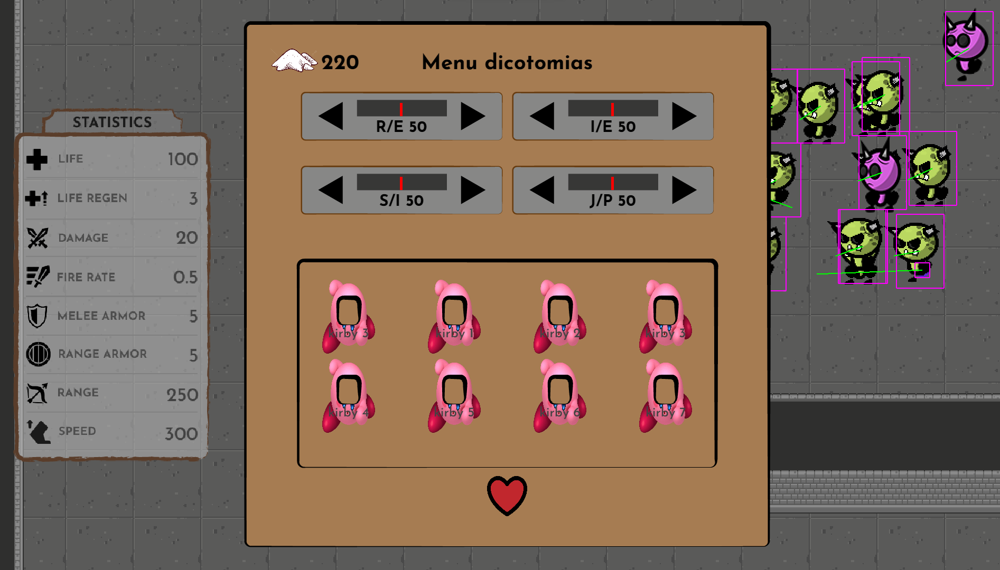
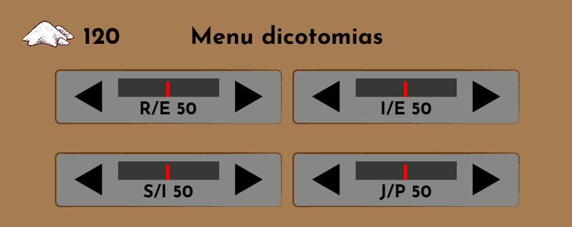
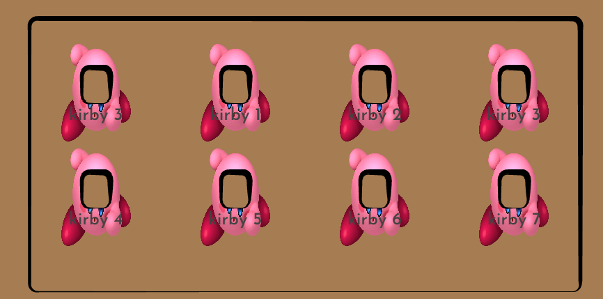
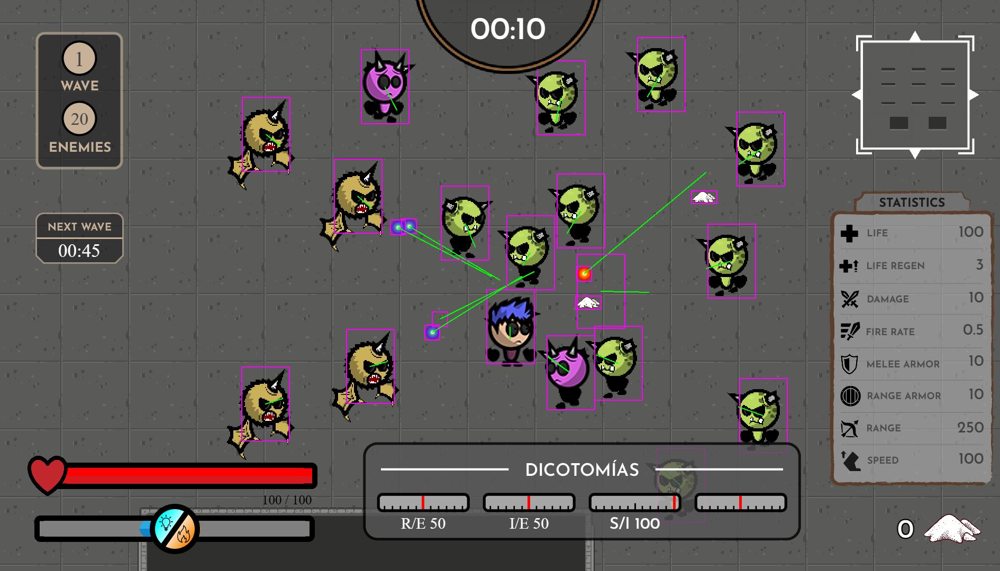
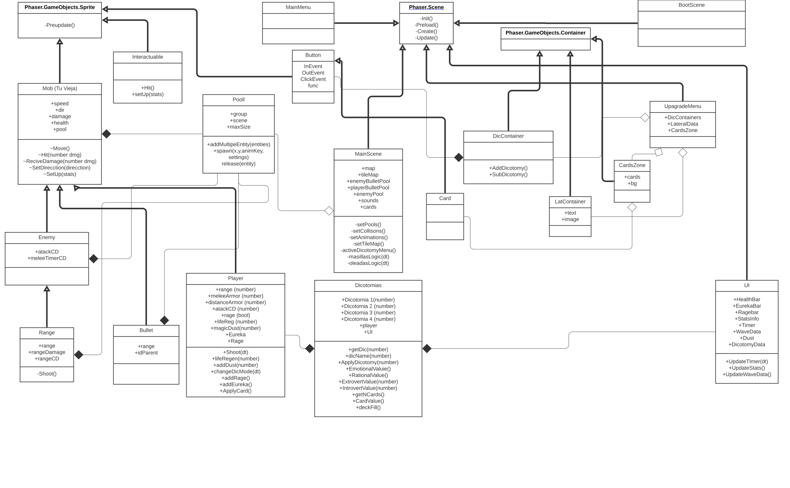

# DOCUMENTO DE DISEÑO DE JUEGO
**PROYECTO MYERS-BRIGGS**
Versión 1.1 - 2 de Noviembre de 2023

Copyright © 2023 - Todos los derechos reservados.

Diego Alonso, Luis Cabello, Samuel García, Luis Parres, Julián Serrano
 
 

## ÍNDICE

* Ficha técnica
* Descripción
* Jugabilidad
* MECÁNICAS
    * Cámara y entorno de juego
    * Movimiento del personaje
    * Apuntado y disparo
    * Mapa de juego
    * Enemigos
    * Eliminación de enemigos
    * Tótem de mejoras
    * Estadísticas base del personaje
    * Mecánicas dicotómicas
        * Primera dicotomía
        * Segunda dicotomía
        * Tercera dicotomía
        * Cuarta dicotomía
* HUD in-game
* HUD menú tótem
* Visual
* Referencias
* Redes y enlaces
 
 

## FICHA TÉCNICA

* **Género:** Juego de acción de disparos y supervivencia por oleadas.
* **Plataforma:** Navegador web con ordenador.
* **Público objetivo:** +14 años. Público juvenil.
* **Estilo visual:** Juego 2D, con vista Top-Down. Gráficos vectoriales.
 
 

## DESCRIPCIÓN

Frenético juego de supervivencia donde el jugador tendrá que enfrentarse a las
interminables oleadas de enemigos mientras mejora su personaje y adapta las mecánicas
de juego acorde a su propia personalidad. A medida que el jugador vaya superando
oleadas, tendrá la oportunidad de personalizar el entorno de juego, y generar ciertas
dinámicas acorde a su forma de ser y de hacer las cosas.

---

 
 

## JUGABILIDAD

El jugador controla a un personaje en **tercera persona**, desde una vista superior, en un mapa limitado a lo alto y a lo ancho. El jugador debe acabar con las **oleadas de enemigos** que se le acercan desde diferentes puntos del mapa mientras evita que estos le puedan dañar. Eliminar estos enemigos otorga al jugador unos **polvos** con los que **ajustará las 4 dicotomias** consumiéndolos.

El objetivo final es aguantar el mayor número de oleadas posible. Al final de la partida se le mostrará al jugador una puntuacion atendiendo a diversos parámetros como el numero de enemigos muertos y los desbalances de las dicotomias

---

 
 

## MECÁNICAS

### CÁMARA Y ENTORNO DE JUEGO

El entorno de juego se percibe mediante una **cámara Top-Down** en dos dimensiones. En el centro de la cámara se encuentra el personaje principal. La cámara acompaña al personaje, imitando sus movimientos y manteniéndolo en el centro del plano.
El jugador puede ver cualquier entidad que se encuentre dentro del frame de la cámara.

### MOVIMIENTO DEL PERSONAJE

El personaje se mueve en el plano del suelo mediante las teclas **W A S D**, siendo el movimento del personaje **continuo en ocho** ejes.
- Se podra parametrizar la *velocidad* del jugador.

### APUNTADO Y DISPARO

El personaje mira de izquierda a derecha de tal forma que mira al lateral hacia el cual se encuentra el **cursor**.
Se dispara continuamente siguendo el parámetro de la **cadencia de tiro**, el cuál saldrá despedido desde el personaje en dirección al ratón.

Los sistemas de movimiento con teclado y apuntado con ratón son independientes, y no se afectan entre sí.

### MAPA DE JUEGO
Solo existe un mapa principal en el juego, donde se desarrolla toda la acción. Este mapa es cerrado, y cuenta con algunos obstáculos y elementos decorativos.

### ENEMIGOS

Los enemigos mantienen siempre el mismo comprotamiento de acercarse hacia la posoción del jugador. Independientemente de otros factores todos los enemigos realizan **daño por contacto** al jugador.

Todos los enemigos cuentan con la siguientes **estadísticas** a parametrizar:
- *vida*
- *daño melee*
- *velocidad de movimiento*

Los enemigos a **distancia** ademas tendrán otros **parámetros**:
- *rango*
- *daño a distancia*
- *enfriamiento de disparo*
- *velocidad de las balas*

Existen dos conjuntos de enemigos con los que el jugador se encuentra de forma recurrente durante toda la partida:

* **Enemigos pertenecientes a una oleada**: Son *generados en grupo*, este siempre se genera de forma relativa al jugador siguiendo puntos dispersados por todo el mapa de juego. Uno de los enemigos de lo oleada soltará un **totem dicotómico** que llevará al jugador al *menú de dicotomias* donde podrá consumir los polvos soltados por los enemigos.

* **Enemigos masilla**: Se generan siempre en cercanía al jugador cada cierto tiempo determinado en puntos de aparicion pseudo aleatorios.

~~Existen distintos tipos de enemigos. Estos difieren entre sí según los siguientes factores:~~ 

* ~~*Distintas estadísticas base* (vida, daño, velocidad…)~~
* ~~*Distintas mecánicas de movimiento* (m.r.u, teletransporte, estático…)~~
* ~~*Distintas mecánicas de ataque* (melé, distancia, AOE…)~~
[^1]

[^1]: Esta parte fue descartada de la primera iteracion de desarrollo debido a la necesidad de avance en otros apartados

### ELIMINACIÓN DE ENEMIGOS
El proyectil disparado tiene un **daño** específico que será infringido al enemigo impactado. Si el proyectil tienemás **daño** que vida le falta al enemigo, el enemigo en cuestión será eliminado pero el proyectil seguirá su ruta,habiéndo reducido su **daño** de forma equivalente a la vida que le faltaba al enemigo eliminado.
Todos los enemigos, al morir, sueltan un **polvo** que podrá ser utilizado posteriormente para desbalancear cada una de las dicotomias que componen la personalidad.

### TÓTEM DICOTÓMICO
El tótem de mejora se queda estático en el mapa allí donde murió el enemigo que lo soltaba (solo una vez por ronda). El jugador interactua con mediante el contacto. Una vez el jugador interactúa con el tótem, el juego se *pausa*, y se abre el menú del tótem. 

El totem desaparecerá cuando el jugador cierre el menú de mejoras reanudando asi el transcurso del juego.

El jugador no tiene porqué interactuar con el tótem según aparece en pantalla. Puede ser utilizado en cualquier momento del juego, pudiendo incluso acumularse si el jugador así lo considera.

### CARTAS DE MEJORA
El jugador tiene acceso a las cartas de mejora al interactuar con un tótem. Se le presentan una serie de cartas la cuales otorgan mejoras planas a las estadísticas base del personaje. El jugador debe elegir las cartas que crea más convenientes, según las mejoras que más le interesen en ese momento.

El **número de cartas** que se presentan, la **cantidad de cartas** que el jugador puede escoger y las **mejoras** que estas suponen se definen como parte de la cuarta mecánica dicotómica (explicada en detalle en el apartado de "*mecánicas dicotómicas*").

### ESTADÍSTICAS BASE DEL PERSONAJE

* *Vida máxima*
* *Daño base*
* *Armadura*
* *Resistencia mágica*
* *Velocidad de movimiento*
* *Rango*
* *Cadencia de disparo*
* *Regeneración de vida*

Estas estadísticas son aumentadas a lo largo de la partida gracias a las cartas de mejora, siendo los efectos de estas permanentes para el resto de la partida. Estas estadísticas también son modificadas al entrar en el estado de rabia.
 
 

## MECÁNICAS DICOTÓMICAS

La idea de juego gira alrededor de las cuatro dicotomías utilizadas como indicadores en el test de Myers-Briggs. Estas dicotomías están definidas como pares opuestos entre ocho
categorías.

### PRIMERA DICOTOMÍA (I/E)
* Extroversión
    : Característica propia de personas cuyo interés está centrado en el entorno y en las personas que le rodean. Personas que prefieren dirigir su energía hacia fuera, orientados a la acción, las cosas, otros individuos.
* Introversión
    : Actitud típica que se caracteriza por la concentración del interés en los procesos internos del sujeto. Personas que prefieren dirigir su energía hacia dentro, orientados hacia ideas, información y pensamientos internos.

En relación a esta dicotomía se introduce la mecánica del equlibrio entre rango y daño. Cuando el jugador crea un desbalance hacia la **extroversión**, el personaje **pierde rango** de alcance, pero **gana daño** y área de acción. Si la dicotomía se desbalancea hacia la **introversión**, el personaje **gana rango** de alcance en sus ataques, pero **pierde daño**.

### SEGUNDA DICOTOMÍA (S/I)
* Sensación
    : Tipo de persona que prefiere tratar con hechos, detalles e información concreta. Hace uso de sus cinco sentidos para percibir y analizar la información.
* Intuición
    : Tipo de persona que prefiere tratar con ideas, conceptos abstractos y teorías. Recibe y analiza la información a través de procesos internos de pensamiento.

Esta dicotomía se relaciona con la **UI**, y la información que aporta. Cuando el jugador crea un desbalance hacia la sensación, este recibirá más información a través de la **UI**, nuevos parámetros y características del estado de juego. Si el jugador desbalancea la dicotomía hacia la intuición, poco a poco se irán eliminando los elementos que conforman la **UI**, liberando el espacio visual del juego.

### TERCERA DICOTOMÍA (R/E)
* Racional
    : Persona que prefiere tomar decisiones desde un punto de vista independiente, utilizando la razón y la lógica para sacar conclusiones. No se precipita en su parecer, y no se deja llevar por impulsos primitivos.
* Emocional
    : Persona que juzga desde un punto de vista interno y sentimental. Siente con más intensidad, y se deja llevar por las emociones, lo que dificulta su toma de decisiones.

En relación a esta dicotomía se crea una nueva mecánica:

#### Rabia / Eureka.
El jugador dispone en todo momento de dos barras de medición. La barra correspondiente a la **rabia** (emocional) se rellena cuando el jugador es dañado por un enemigo. La barra correspondiente al **eureka** (racional) se rellena cuando el jugador daña a un enemigo.
- Al completar la barra de rabia, el personaje gana un bonus multiplicativo de daño y obtiene un porcentaje de robo de vida, pero también recibe más daño de los enemigos. Este estado de rabia tiene un tiempo de duración.
- Al completar la barra de eureka, los enemigos se veran congelados en el tiempo, quedando inmóviles y no pudiendo hacer daño al jugador mientras que este podrá moverse y atacar de forma libre.

### CUARTA DICOTOMÍA (J/P)
* Juicio
    : Característica de las personas que prefieren experiencias planificadas y bien estructuradas. Construyen un proceso mental paso a paso, prefiriendo el orden y el control sobre los sucesos futuros.
* Percepción
    : Actitud típica de las personas flexibles, que se adaptan al medio y que prefieren dejarse llevar por la corriente. Son personas espontáneas, de circuito corto, que improvisan en tiempo presente.

En relación a esta dicotomía se presenta la mecánica de las **cartas de mejora**. Cuando el jugador interactúa con un **tótem**, este tendrá acceso a una serie de **cartas de mejora**, que sirven para aumentar las **estadísticas base** del personaje, teniendo que elegir cuales desea obtener de entre las cartas que se le presentan.

Al desbalancear la dicotomía hacia el *juicio*, un **mayor número de cartas** son presentadas al jugador, aunque la mejora resultante de cada carta individual será un poco peor.

Si la dicotomía es desbalanceada hacia la *percepción*, el jugador podrá elegir entre muchas **menos cartas**, dependiendo pues de la suerte de cada momento, aunque cada una de ellas individualmente otorgará una mejora más sustancial.

---
 
 

## UI
En el juego como ya se ha visto antes la interfaz del usuario tiene un papel muy importante y tiene mucho cambio dinamico. Se diferencian dos interfaces de gran importancia: **el menu de dicotomias** y **la interfaz durante la partida**

### Menu de totem dicotomico
En este menú se podra desbalancear cada una de las cuatro dicotomias ya explicadas ademas de dar informacion al jugador de las estadisticas del personaje. 
En esta interfaz diferenciamos 3 sectores

* **Sector 1**: *Balanzas con las 4 dicotomías de las **personalidades***. 
Pulsando los botones el dial rojo de cada dicotomia se *desbalancea*, haciendo que se altere el valor de la dicotomia y que se reduzca el numero de **polvos** indicados en la parte superior izquierda

* **Sector 2**: *Cartas de mejora*. 
El número de **cartas** que a aprecen y el numero de cartas que se pueden seleccionar variará segun el valor de la dicotomia **J/P**. Las **cartas** indicaran que **estadistica** modifican y con cuanto **valor** ademas de tener como imagen el icono relacionado con esa estadística.

* **Sector3**: *Estadísticas*. 
A la izquierda se muestra el estado de las **estadisticas** del jugador. Estas cambiaran de forma dinamica al elegir **cartas** o al desbalancear la dicotomia **I/E**.

### Menu in game

Este menu esta dividido en *8 sectores* que iran apareciendo o desapareciendo en funcion del desbalance dicotomico **S/I**
#### Barra de vida
#### Barras de Eureka y Rabia
#### Cantidad de Polvos
#### Diales de dicotomias
#### Estadisticas del personaje
#### Informacion sobre oleadas
#### Tiempo de partida
#### Mini Mapa

## VISUAL

Para el apartado visual usamos principalmente assets con licencia CC0 o con licencia adquirida, obtenidos a través de páginas especializadas en internet. También usamos nuestros propios assets cuando buscamos un gráfico muy específico, o modificamos los adquiridos (cuya licencia no tenga un atributo ND) para satisfacer nuestras necesidades concretas.

El estilo visual es con gráficos vectorizados y colores planos. Esta decisión de diseño se basa en la naturaleza del juego, cuyo ritmo frenético y mecánicas skill-based solo funcionan si se da al jugador un feedback claro e inteligible. Este feedback se vuelve gratificante mediante la incorporación de mecanismos como VFX o camera-shake.
 
 

## REFERENCIAS

* *VAMPIRE SURVIVOR* 
Juego de acción y supervivencia por oleadas utilizado para crear la base del proyecto.
Las mecánicas de cámara, movimiento, enemigos y dinámica de juego se basan en este título u otros títulos de estilo similar.

* *REIGNS* 
Juego con una mecánica vertebral de toma de decisiones. Referencia importante a la hora de decidir cómo íbamos a crear un juego en torno a las 16 Personalidades. El concepto de las 4 dicotomías del test de Myers-Briggs ha sido introducido en el juego teniendo muy en cuenta el funcionamiento de Reigns y las dinámicas que genera el juego.

* *DIEP.IO* 
Juego de navegador cuyo sistema de evoluciones modifica la mecánica básica de disparo.
Estas modificaciones generan nuevas dinámicas y estrategias en el juego. La forma que tiene el jugador de adaptar y personalizar las mecánicas de juego gracias a las cuatro dicotomías recuerda a este título multijugador casual.
 
 

## UML

 
 

## REDES Y ENLACES

https://www.instagram.com/_scriptedgames/

https://twitter.com/_scriptedgames

https://github.com/Lparres2000/JuegoPVLI
